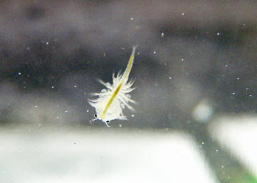
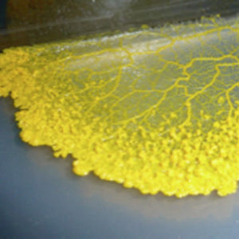
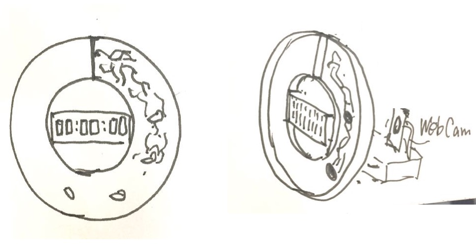
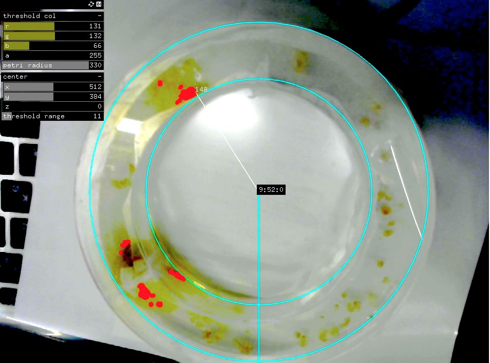

# Bio Hack Academy 4 - Shin Hanagata

## Who am I
I am studying interaction design at Yasuaki Kakehi Lab in SFC, Keio Univ, and  sometimes making artworks using programming/engineering & bio-phenomena.  Also, I sometimes paint with oil colors. 
[My portfolio](http://hana-folio.tumblr.com)

# My Project: Capricious Clock
人間以外の生き物にも、リズムがあり、当然ながら人間とは異なる時間感覚を持って生きている。 
もちろん、私が今育てている、ブラインシュリンプと粘菌にもリズムがある。 
そこで、そうした生き物の生み出すノイズを含むリズムや生理現象のペースを用いて、 **生命的な気まぐれさを持った時計**を制作する。 
 
All living things have their own rhythms.
They are different from human being’s. 
My pets; brine shrimps and slime mold have also rhythms. 
So, using them, I will make **a capricious clock including living noises**. 

  
[brine shrimps mixing color liquid(MOVIE)](https://www.instagram.com/p/BQe6pyQB38N/?taken-by=hngt_a) 
 

# Design & Implementation

## Plan A; slime mold 
 
### What it is
1. **粘菌の移動速度:1cm/hを踏まえて、円周を24cmにしたドーナツ型培地に粘菌を放つ。** According to the moving speed of slime mold: 1cm/h, make doughnut shaped agar whose circumference is 24cm.  
1. **任意の地点にオートミールを配置し、粘菌を動かす。** Put peaces of oatmeal at optional points, and make the slime mold move.  
1. **粘菌の動きを背後のwebcamで捉え、円周上のどの地点まで到達したかをOpenCvで認識する。** Set webcam behind the agar, and capture what proportion of the circle is the point that slime mold reaches with image recognition(openframeworks/openCv).  
1. **円周を24時間と捉え、到達地点の円周に対する割合×24時間として、表示する時刻を決定する。** Regarding 24cm circumference as 24 hours, Decide the time as above propotion × 24 hours.  
 
->気まぐれ時計の出来上がり! 
->Finish to make a capricious clock! 

 

**This capture is that slime mold reached at the place of 09:52:00 on doughnut petri-dish**

-
### Concrete How to Make

#### 画像認識
	
1. 映像の取得(vidGrabber)
2. pixelの色情報を取得
3. (ドーナツ型の中だけという条件をつけるかも。)
4. 粘菌の色域を選定
5. 円の中心から放射Lineを引いて、そのLine上に粘菌色のpixelがあるかどうか判定
6. そのlineの角度から時刻を表示

#### ドーナツ型培地

0. **縦長の培地で粘菌の走行速度を図る**。
1. レーザーで、(**(150φ外径、100φ内径のドーナツ２つ目は気持ち大きめ)×2+仕切り+4本の柱**)3setをイラレで描いて、切る
2. アクリサンデーで組み立てる／周囲をプラ板で覆う
3. Agarを入れて冷やす
4. (粘菌を放つ)

##### ▶︎ドーナツシャーレ; ver.1
内径100Φ、外径150Φ　、底面アクリル板／側面プラ板

 
 	
> 	ドーナツ型培地を綺麗に作る対策。ver2に向けて。
> 	
> 	* 瞬間接着剤を使う
> 	* 底面と壁の間に凸凹をつけて噛み合わせる。（隙間なく！）
> 	* 熱で湾曲させて反発を減らす。
> 	* 円周のちょうど半分の長さで切っとく。

##### Agar培地作り
0. 寒天粉の説明文通りに作って冷やす。 
1. 粘菌を放つ
2. 

#### OUTPUT

* 7セグメントLEDで表示
* 治具
	* カメラと培地の総体位置を固定する
	* シャーレスタンド
	* iPhone用の三脚でいいか？

-

# Usage & Application
(基本的にplanAについて書く) 
この時計をもとに暮らしてみると、粘菌に基づいたペースで生活を送ることになる。 
 **粘菌の気まぐれで、1時間や、1日が伸び縮みする。** 元気がなければゆっくり進み、お腹が空けばすぐに時間が経つだろう。 
粘菌ベイスドライフ。 
 
オートミールに粘菌が到達した時に自分も食事する生活を送ってみるのも良いかもしれない。１オートミールあたり200カロリーなどと決めて、食事をして、食べたら、次のオートミールをおく。これで、粘菌の食事とあなたの食事のバイオリズムがリンクした生活の出来上がり。 
この生活を送ったら何を感じるだろうか。 
 
**他にはどんな使い方があるだろうか？ **
**みんなと議論したいです！ **
 
 
(Basically, I write about Plan A) 
If you live with this clock, your daily life will be based on the slime mold. 
**Caprice of the slime mold causes that hour/day spread/shrink.** 
If they are not fine, time will go slowly, and if they are hungry, time will go fast. 
That is Slime mold Based Life! 
 
It is maybe also good life that when the slime mold reaches oatmeal, you also have meal. 
For example, you decide 200kcal per 1 peace of oatmeal, and you put a next peace after your meal. 
So, you finished to make the life linked your meal with slime mold link! 
What do you feel while/after such life? 
 
**Anything else, What way to use is there? **
**I wanna discuss with everyone! **